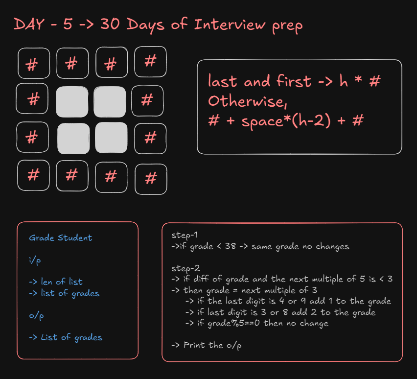

# 30 Days of Interview Preparation

## Day 4

### Challenge - 1
https://www.hackerrank.com/contests/archive-pec-code-quest-roundtwo-coders-forum/challenges/8-isitpossible-cf/
#### IsItPossible

### Challenge - 2
https://www.hackerrank.com/contests/codeblitz-2/challenges/square-pattern-19-1/
#### Square Pattern

### Challenge - 3
https://www.hackerrank.com/challenges/grading/problem
#### Grading Students

### Challenge - 4
https://www.hackerrank.com/challenges/30-class-vs-instance/problem
#### Class VS Instance

### Challenge - 5
https://www.hackerrank.com/challenges/japanese-cities-attributes/problem

